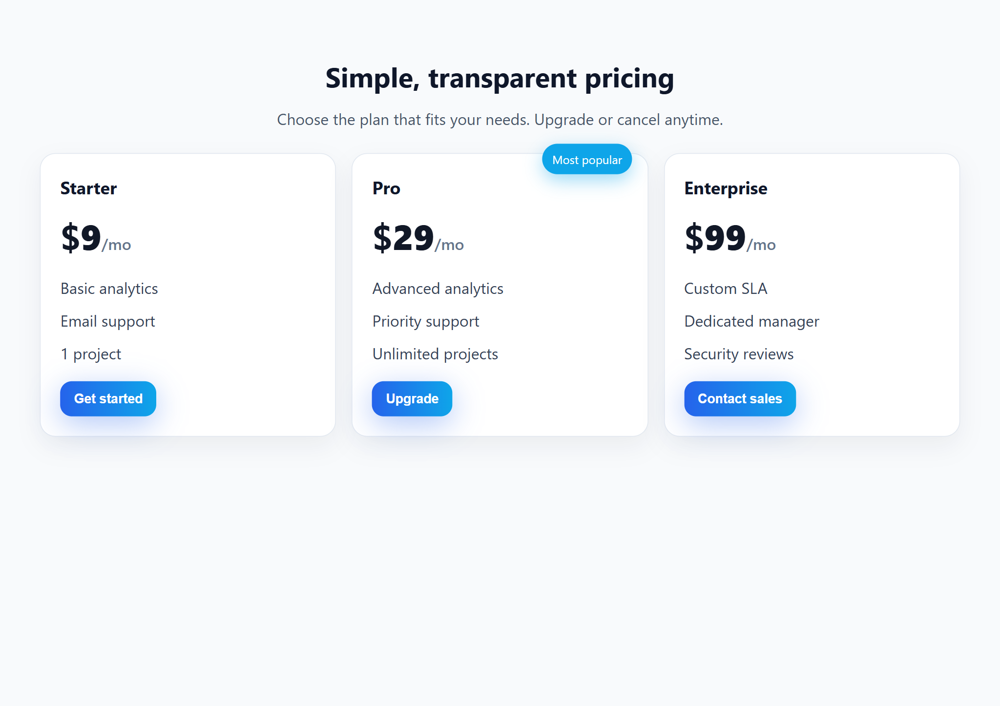

## Team Directory — Cursor Assignment

### Overview
This branch (`team_directory`) contains a **responsive Team Directory web app** that reads data from `team.json` and renders team member cards. It is designed to be a small project for practicing Cursor’s debugging and AI-assisted workflows.

### Files
- `index.html` – Main HTML page with layout for the header, filters, and team grid.
- `style.css` – Responsive layout and card styles.
- `script.js` – Fetches `team.json`, renders cards, and wires up search/filter logic.
- `team.json` – Sample team data (name, role, department, location, email).

### Features
- **Responsive layout**: Team cards use a flexible grid (`auto-fit` + `minmax`) to adapt from mobile to desktop.
- **Search**: Filter team members by typing part of their name, role, or location.
- **Department filter**: Dropdown to filter by department, populated from `team.json`.
- **Live summary**: Shows how many team members match the current filters.

### How to run locally
Because `script.js` uses `fetch` to load `team.json`, you should run this over HTTP instead of opening `index.html` via `file://`:

1. In Cursor or your editor, open the project folder.
2. Start a simple static server, for example:
   - Using Node: `npx serve .`
   - Or use your editor’s “Live Server” / “Preview” feature.
3. Visit `http://localhost:PORT/index.html` in your browser.

You should see the team cards rendered from `team.json`. Try the search and department filter to verify everything works.

### Suggested debugging exercise (for the assignment)
- Introduce (or find) a small bug (for example, typo in a property name in `team.json` or `script.js`).
- Use **Cursor’s “Fix”** suggestion on the error highlight to automatically propose a correction.
- Review and apply the suggestion, then re-run/refresh to confirm the fix.

### Branch
- This work lives on the `team_directory` branch of the repo.

## Cursor Assignment V2 — Task 6

### What was built
- Real-time email validation visualizer that shows:
  - Rule-by-rule checklist (non-empty, no spaces, one @, valid local, valid domain, valid TLD).
  - Live breakdown of local, @, domain, and TLD parts.
  - Final status banner that flips between Valid/Invalid.

### Files
- `index.html`: Visualizer UI (input, rules, breakdown, regex view).
+- `style.css`: Panels, checklist dots (pass/fail), breakdown, status styles.
+- `app.js`: Real-time parsing and validation with UI updates.

### Preview

### How to run
1. Open `index.html` in a browser/IDE preview.
2. Type an email like `john.doe+news@example.co.uk` to watch each rule update.
3. The final banner will indicate whether the email is considered valid.
## Cursor Assignment V2 — Task 5

### What was built
- Three-column pricing table with hover transitions.
- Mobile “stacked deck” effect: cards overlap and unstack on scroll.
- Staggered on-scroll reveal using IntersectionObserver.

### Files
- `index.html`: Pricing section with Starter, Pro, and Enterprise cards.
- `style.css`: Responsive grid, stacked mobile animation, hover styles.
- `app.js`: On-scroll staggered reveal logic.

### Preview

### How to run
1. Open `index.html`.
2. On desktop, see 3 columns; on mobile, cards stack and reveal on scroll.
3. Hover a card to see lift and shadow transition.

