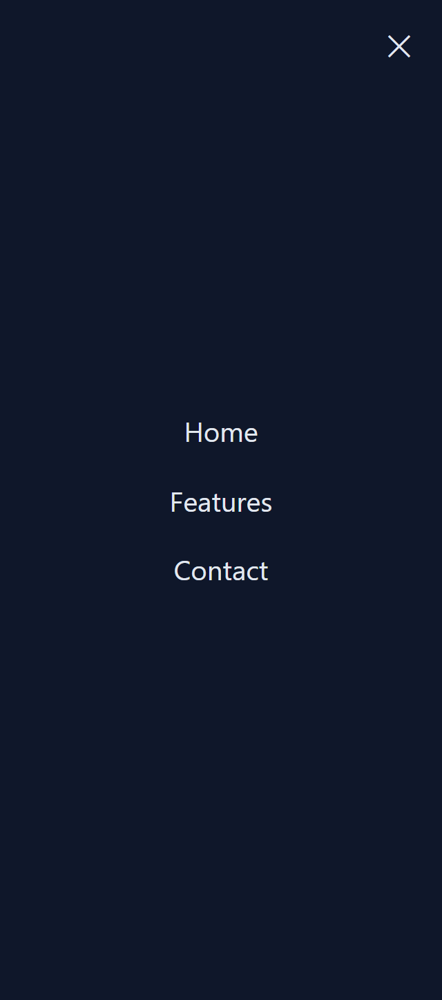

## Cursor Assignment V2 — Task 2

### What was built
- Responsive navigation bar with a full-screen mobile menu.
- Circular “blob” reveal animation on open; smooth transition.
- Close icon and close-on-link behavior on mobile.

### How it works
- Desktop (>=768px): inline navigation.
- Mobile: hamburger opens a full-viewport overlay. The reveal’s origin is positioned at the hamburger button.

### Files
- `index.html`: Navbar markup with toggle and close button.
- `style.css`: Overlay styles, clip-path circular reveal, transitions.
- `app.js`: Toggle logic, reveal origin positioning, and close handlers.

### Preview

### Run
Open `index.html` in a browser or IDE preview. Resize to see behavior change.

