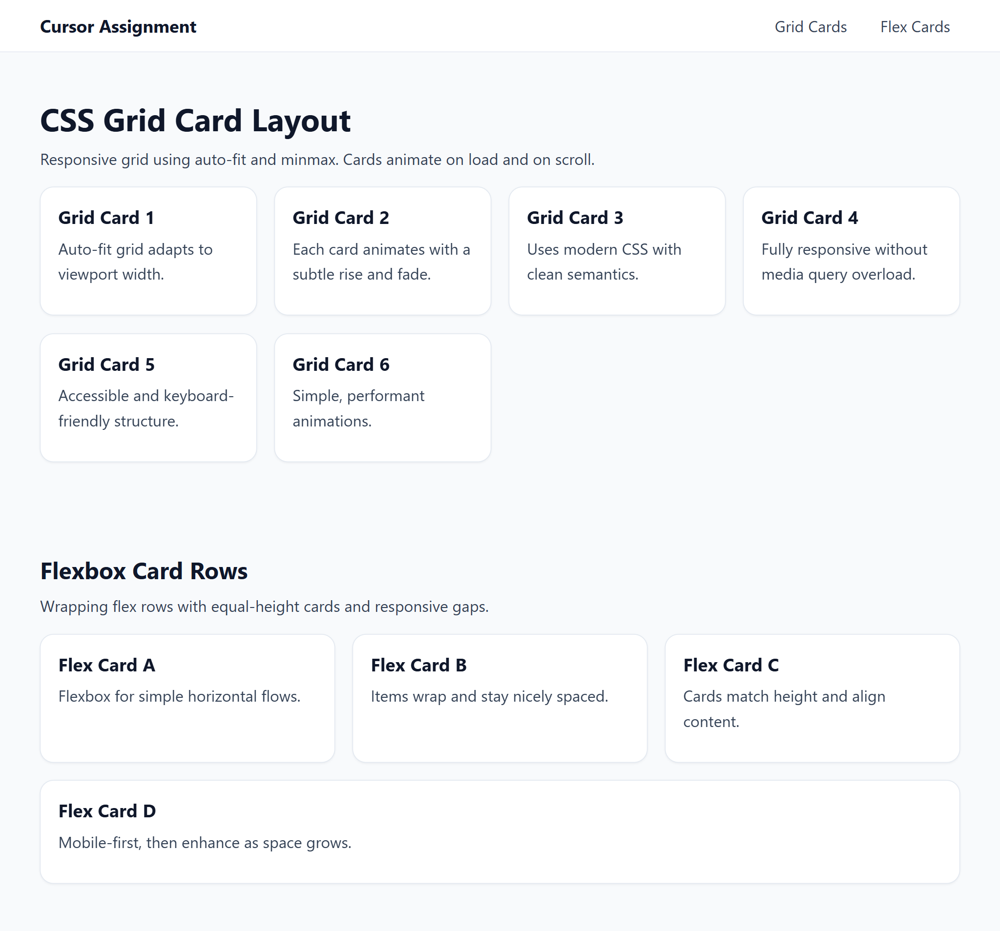

## Cursor Assignment V2

### Branches
- `task_1`: Simple responsive webpage with header, two sections, footer
- `task_2`: Responsive navigation bar with full‑screen circular reveal on mobile
- `task_3`: Multiple card grids (CSS Grid + Flexbox) with load/scroll animations

### Task 1
- Built a responsive page:
  - Header with brand and nav, two sections (hero + content), and footer.
  - Mobile-first CSS; grids adapt at breakpoints.
  - JS for footer year and mobile nav toggle.

### Task 2
- Implemented a responsive navbar:
  - Desktop: inline nav.
  - Mobile: full-screen overlay with circular “blob” reveal from the hamburger, smooth transitions, close button, and close-on-link.

### Task 3
- Added two card layouts and animations:
  - CSS Grid section with auto-fit minmax columns.
  - Flexbox section with wrapping, equal-height cards.
  - IntersectionObserver to animate cards on load and when scrolled into view.

### Preview
Previews for each task:

- Task 1: [Preview image](https://github.com/Manmohan2526/cursor_assignment_v2/blob/task_1/task_1_preview.png)
- Task 2: [Preview image](https://github.com/Manmohan2526/cursor_assignment_v2/blob/task_2/task_2_preview.png)
- Task 3:

### How to run
1. Open `index.html` in a browser or IDE preview.
2. Resize to test responsiveness and mobile menu behavior (Task 2).
3. Scroll to see card animations (Task 3).

### Files of interest
- `index.html`: Page structure per task.
- `style.css`: Mobile-first styles, navbar overlay, grid/flex cards, animations.
- `app.js`: Mobile nav logic (Task 2) or IntersectionObserver animations (Task 3).

