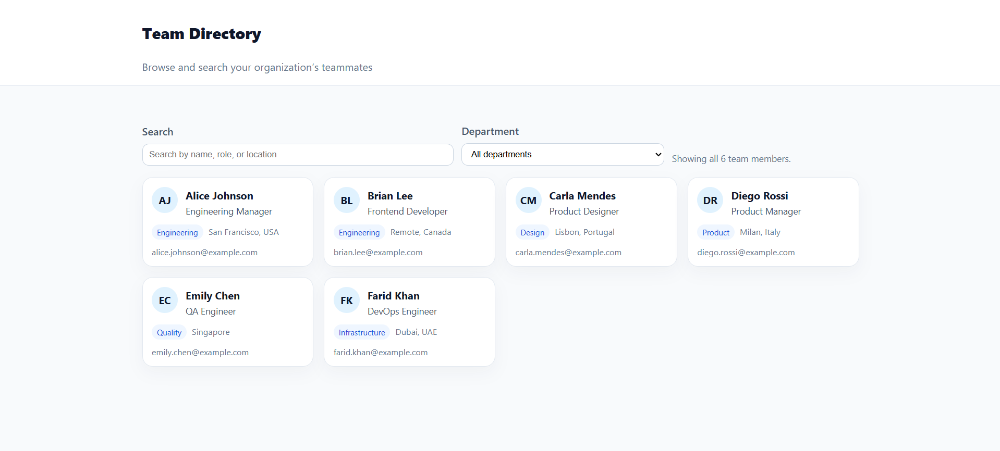

## Team Directory — Cursor Assignment

### Overview
This branch (`team_directory`) contains a **responsive Team Directory web app** that reads data from `team.json` and renders team member cards. It is a focused assignment to practice building a small UI and using Cursor to debug and refine behavior.

### Files
- `index.html`: Layout for the header, filters, and team grid.
- `style.css`: Responsive layout and card styling.
- `script.js`: Fetches `team.json`, renders cards, and wires up search/filter logic.
- `team.json`: Sample team data (name, role, department, location, email).

### Features
- **Responsive layout**: Team cards use a flexible grid (`auto-fit` + `minmax`) to adapt from mobile to desktop.
- **Search**: Filter team members by typing part of their name, role, or location.
- **Department filter**: Dropdown to filter by department, populated dynamically from `team.json`.
- **Live summary**: Shows how many team members match the current filters.

### How to run locally
Because `script.js` uses `fetch` to load `team.json`, you should run this over HTTP instead of opening `index.html` via `file://`:

1. Open this folder in Cursor or your editor.
2. Start a simple static server, for example:
   - Using Node: `npx serve .`
   - Or use your editor’s “Live Server” / “Preview” feature.
3. Visit `http://localhost:PORT/index.html` in your browser.

You should see the team cards rendered from `team.json`. Try the search and department filter to verify everything works.

### Debugging example (what we fixed)
While testing filters, we noticed that when a department search returned **only one person**, their card stretched to the full grid width on desktop, breaking the visual rhythm of the layout.

To fix this, we:
- Inspected the DOM/CSS and confirmed that with a single grid item, it naturally expanded to fill the full row.
- Updated `style.css` so that:
  - `.team-grid` uses `justify-items: center` to center its children.
  - `.team-card` has `width: 100%` with a desktop `max-width` (e.g. `340px`), while on mobile the card can still be `100%` width.
- Re-ran the app and verified that filtering down to a single person now keeps a nice card width on desktop while remaining full-width on smaller screens.

### Preview

### Branch
- This work lives on the `team_directory` branch of the repo.

