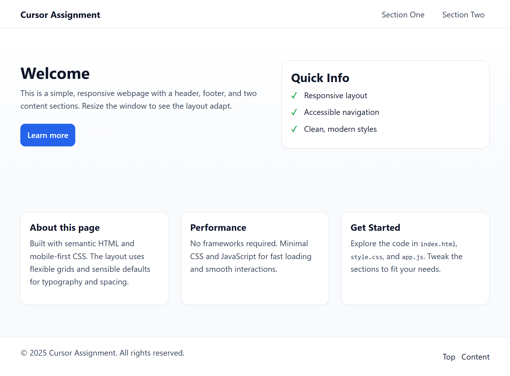

## Cursor Assignment V2 — Task 1

### What was built
- **Responsive webpage** with a header, footer, and **two content sections**.
- **Mobile-first** layout with a collapsible navigation (hamburger on small screens).
- Minimal **JavaScript** for mobile nav toggle and dynamic footer year.

### Files updated/created
- `index.html`: Semantic HTML structure (header with brand and nav, two sections, footer).
- `style.css`: Mobile-first responsive styles, grid layouts, sticky header, cards, buttons.
- `app.js`: Footer year injection and mobile navigation toggle.
- `README.md`: This documentation.

### How to preview locally
1. Open `index.html` in your IDE or browser.
2. Resize the window to verify responsiveness:
   - On small screens, the nav collapses behind a hamburger button.
   - Sections stack on mobile, switch to grids on tablet/desktop.

### Branch and links
- Branch (direct): `https://github.com/Manmohan2526/cursor_assignment_v2/tree/task_1`
- Latest commit on this task: visible in the branch history.

### Summary
This task sets up a clean, fast-loading, responsive page using semantic HTML, modern CSS, and a tiny bit of JS—kept framework-free for simplicity and performance.

### Preview

