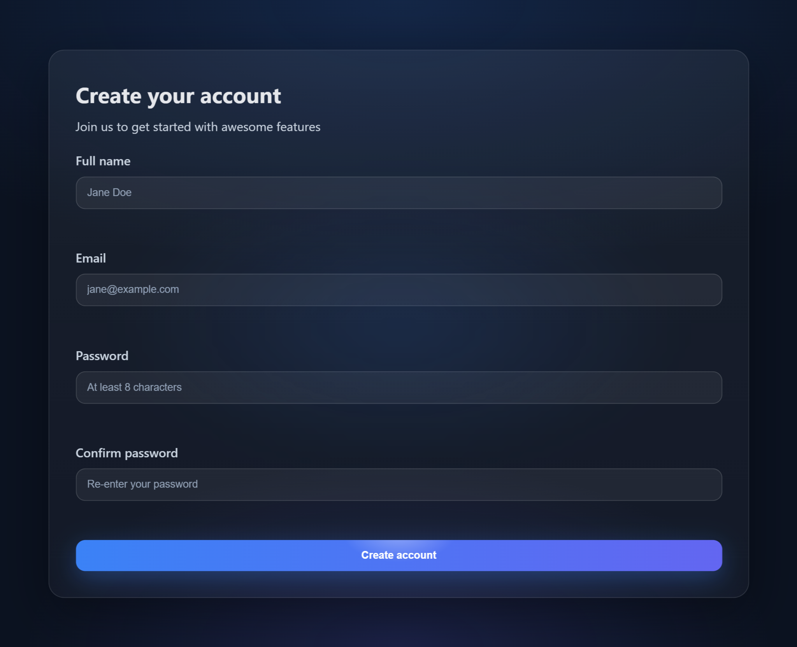

## Cursor Assignment V2 — Task 4

### What was built
- Attractive, animated registration form with:
  - Mouse-direction hover effects (tilt, gradient follow, button shine)
  - Real-time input validation and submit validation
  - Thank-you screen that displays after successful registration

### Files
- `index.html`: Registration form and hidden thank-you panel
- `style.css`: Glassmorphism card, gradients, responsive styles, interactive hover
- `app.js`: Validation logic, thank-you toggle, and mouse-interaction handlers

### Preview

### How to run
1. Open `index.html` in a browser/IDE.
2. Move your mouse over the card to see the tilt and gradient follow.
3. Fill the form with valid inputs (e.g., email like test@test.com) and submit to see the thank-you screen.

