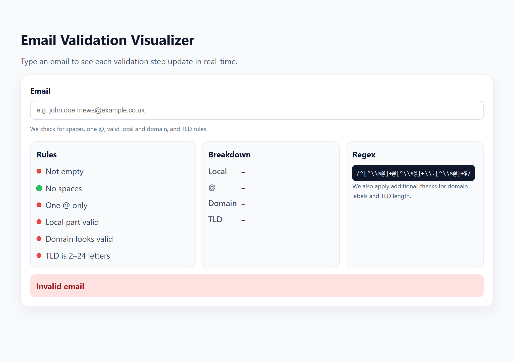

## Cursor Assignment V2 — Task 6

### What was built
- Real-time email validation visualizer that shows:
  - Rule-by-rule checklist (non-empty, no spaces, one @, valid local, valid domain, valid TLD).
  - Live breakdown of local, @, domain, and TLD parts.
  - Final status banner that flips between Valid/Invalid.

### Files
- `index.html`: Visualizer UI (input, rules, breakdown, regex view).
+- `style.css`: Panels, checklist dots (pass/fail), breakdown, status styles.
+- `app.js`: Real-time parsing and validation with UI updates.

### Preview

